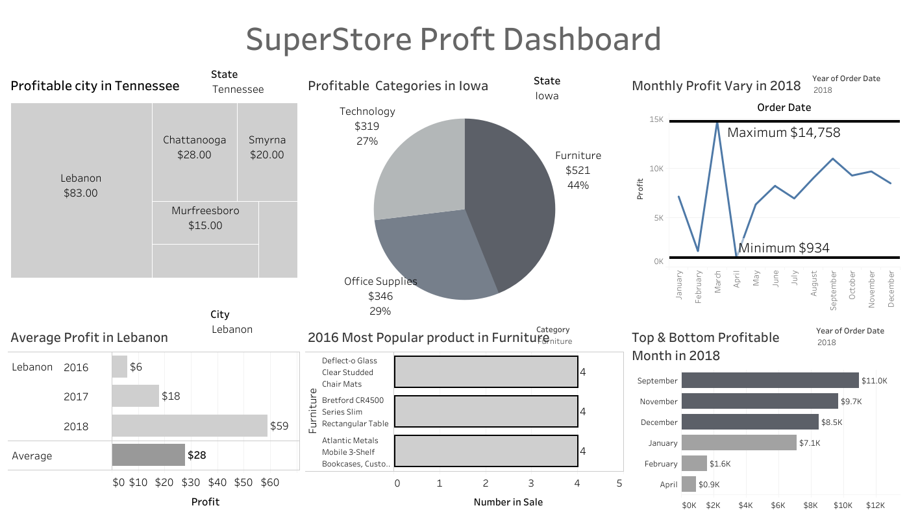

# Understanding Data with Tableau

I have displayed a few Tableau Dashboard using public datasets below. You can find each Tableau Workbook within the "Workbook" directory in this repo. Feel free to check out images of the dashboards below, and download any workbook that interests you. I also included SQL queries to wrangle the data into the correct representation.

# Superstore_Dashboard
From the Data Visualization Nanodegree. This dataset contained order information on superstore item sales from 2014 to 2018. 
Dataset: [US Superstore data ](https://www.kaggle.com/juhi1994/superstore).

## Superstore Strategic Dashboard

- Workbook Name: [Superstore Operational Dashboard](https://public.tableau.com/profile/donghuai.li#!/vizhome/FinalSuperstoreDashboard/superstore)

 The strategic dashboard is designed to show main points of interes to the full executive team:
- Top-level revenue, profit, average profit ratio and units sold
- YoY performance by segment (segment refers to Corporate, Consumer, Home Office)
- Monthly trend of the current year by segment (segment refers to Corporate, Consumer, Home Office)
- View category performance
- Best performing sub-category within each customer segment

## Superstore Operational Dashboard

- Workbook Name: [Superstore Operational Dashboard](https://public.tableau.com/profile/donghuai.li#!/vizhome/SuperstoreDashboard_15952913305750/Superstore)
- Dataset:  [US Superstore data ](https://www.kaggle.com/juhi1994/superstore)

The operational dashboard trying to answer following business questions:
- What is the most profitable City in the State of Tennessee?
- What’s the average annual profit for that city across all years in that city?
- What’s the most profitable product category on average in Iowa across all years?”
- What is the most popular product in that category in 2016?
- What was the most profitable month in 2018 overall?
- How widely did monthly profits vary in 2018?

## Flights Delay Dashboard

- Workbook Name:[Flights Delay Dashboard ](https://public.tableau.com/profile/donghuai.li#!/vizhome/insight1_15949455103090/Story1) 
- Dataset:  [Flights Delay data ](https://www.kaggle.com/usdot/flight-delays/data)

This is a story created by Tableau. Three parts of the story dipict insights I refined from dataset. Topics included:
- Airports in south and west of U.S. is more likely to have a high delay and vice versa.
- Arilines have significant difference delay time, Spirit Air Lines has most delay and Alaska Airlines has least delay. However, the huge standard variance of delay time in each airline implies the average delay time is not a strong reference of expect delay time based on airlines.
- Weekend has more delay than weekdays in December, January and February. And weekend has less delay than weekdays in September. . The rest of months they have similiar delay time to each other.

